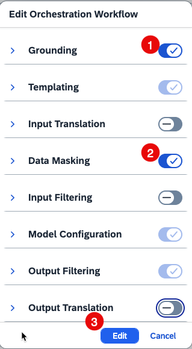

## Build an Orchestration Workflow

The orchestration pipeline consists of several steps, including grounding, prompt templating, data masking, content filtering, input and output translation, and model configuration. Among these, only the **Templating** and **Model Configuration** steps are mandatory. The inclusion of other steps depends on your specific use case. You can easily enable or disable optional steps using the provided toggle switches.

1. Choose **Generative AI Hub** -> **Orchestration** -> **Create**. 

    

2. Choose **Edit Workflow**. 

    

3. Turn on both **Grounding**, **Data Masking**, and **Output Filtering**, turn off the other steps, and choose **Edit**. 

    

4. Choose **Templating** -> **User** to create a prompt template. 

    ~~~
    Request: {{?groudingRequest}},  Context: {{?grounding_output_variable}}
    ~~~

    

5. Choose **Grounding** and add the following: 

    - Input Variables: **groudingRequest**

6. Choose **+** to add a new data repository. 

    

7. Choose the data repository that you created before, and choose **Select**. 

    

8. Change the Max Document value to **7**. Since 7 documents have been uploaded, this number should roughly match either the total number of documents or the total number of chunks. This ensures that the LLM can use the maximum available context for data retrieval.

    

9. Choose **Data Masking** and select **Person Names**. 

    >📝**Note**: Data masking is a crucial technique used to protect sensitive information when interacting with Large Language Models (LLMs). It involves replacing identifiable or confidential data within prompts with placeholder text, ensuring that such information is not exposed to third-party models. This approach is particularly important for safeguarding personally identifiable information (PII) and other sensitive details.  
    In this mission, the supplier data contains contact names. Since these names are not needed in the final output, we will mask them in this step to ensure they are not visible in the results.

    

10. Choose **Model Configuration** -> **Model Selection**. 

    

11. Choose **GTP-4o** model. 

    

12. Review the updated model selection. 
    
    

13. (Optional) Choose **Output Filtering**  
    In this mission, we will not apply input or output filtering. However, take a moment to explore the available filtering options and settings.
    >📝**Note**: Content filtering during inference in Large Language Models (LLMs) is a critical process that ensures the quality and relevance of input and output data. It involves evaluating and selecting data to prevent low-quality or irrelevant inputs from affecting model performance. Certain ethical problems, such as bias mitigation and fairness, must be addressed to prevent disproportionate filtering of specific groups or viewpoints. Refer to [SAP Help Portal](https://help.sap.com/docs/ai-launchpad/sap-ai-launchpad/input-filtering) for more details about Input Filtering and Output Filtering.

    

14. Switch to the **Test** tab and provide Input Variables with the following details: 
    ~~~
    How is Techtronix Components Ltd. performing?
    ~~~

15. Choose **Run**.  

    

16. After a moment, the LLM should return a comprehensive answer.  
    In this scenario, Techtronix Ltd. is one of the suppliers for our sample company, SmartSense Technologies. We’ve uploaded a collection of supplier-related documents, including contracts, audit reports, and delivery records. The LLM has processed and analyzed all of this information to generate a comprehensive, data-driven answer to your question.

    

17. Choose **Reset** and provide Input Variables with the following details:  
    
    ~~~
    Compare delivery reliability and audit scores across all three suppliers and recommend which supplier to prioritize for our next order.
    ~~~

18. Choose **Run**. 

    