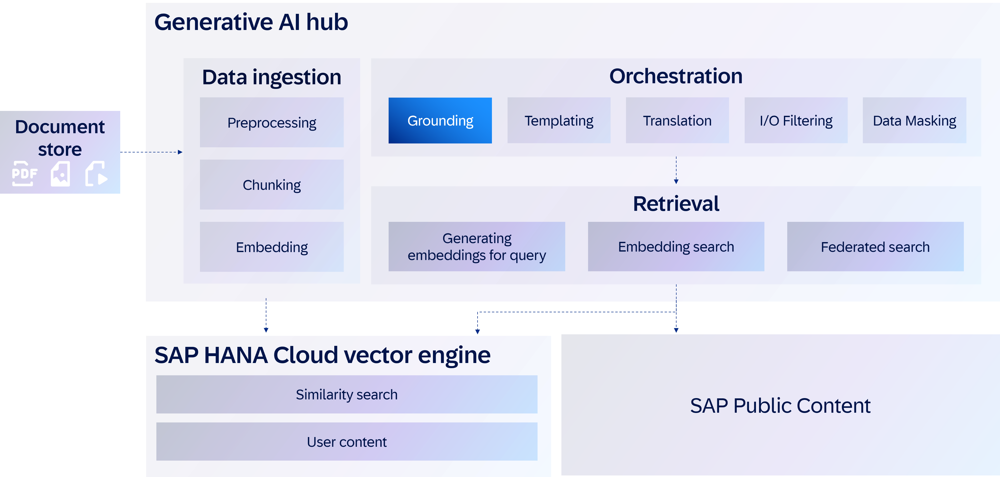
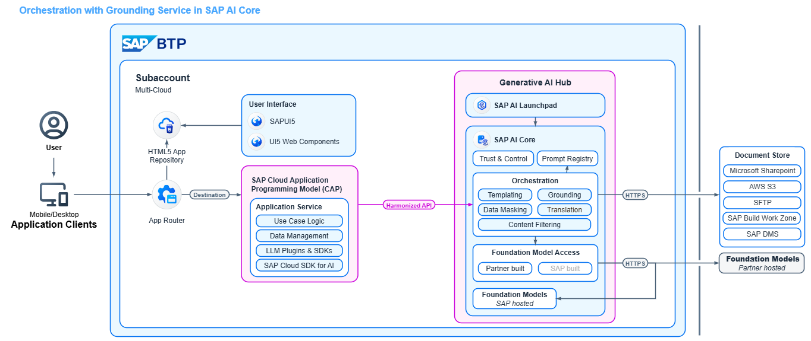

In this mission, we will explore how to design and execute an orchestration pipeline in **SAP AI Core**. The pipeline integrates multiple modules into a seamless flow where the output of one module becomes the input of the next, enabling you to automate complex tasks with a single API call. **Orchestration** in SAP AI Core is a managed service that provides unified access to multiple generative AI models through a harmonized API. This means you can switch between different foundation models, or even different model versions, without needing to change your client code. To achieve this, you must either create an orchestration deployment in your own resource group or use the preconfigured deployment available in the default resource group. 

### Business Problem
At BestRun Technologies, the procurement team plays a critical role in ensuring the uninterrupted production of the company’s smart-IoT security devices. To maintain high product quality and reliable supply chains, the team sources essential components from a carefully curated network of trusted suppliers.

Ahead of each quarterly business-review (QBR) meeting, company executives seek clear, data-driven insights into supplier performance. Typical questions include:

- “How is Techtronix Components Ltd. performing compared to previous quarters?”
- “What contractual penalties apply if PulseWave Materials Inc. fails to meet its delivery commitments?”
- “Are there recurring quality issues with Sigma Electronics Co. that we need to escalate?”

While the questions are straightforward, the answers are not. The required data is often buried across multiple, disconnected sources: purchase orders, on-time delivery reports, quality-incident logs, supplier audit scores, and PDF contracts. Procurement analysts are forced to spend hours combing through SharePoint folders and spreadsheets, manually stitching together insights that are frequently incomplete or out of date. Even after this effort, critical details may still be overlooked—for example, a hidden late-delivery penalty clause buried in a lengthy contract, or a subtle pattern of quality defects emerging from incident logs.

This fragmented process introduces unnecessary delays and increases the risk of misinformed decisions at the executive level. In fast-moving industries like IoT, where component shortages or supplier failures can disrupt entire production cycles, relying on slow, error-prone manual compilation is no longer sustainable.

BestRun Technologies recognized the need for a smarter, automated way to surface and contextualize supplier insights. By indexing supplier documents and applying advanced tools such as SAP’s Generative AI Hub with document grounding, procurement teams can now retrieve precise, contract-aware answers in real time. Instead of sifting through raw documents, executives receive concise, context-rich briefings that connect delivery metrics, quality records, and contractual obligations into a single, reliable narrative.

This shift not only saves valuable time but also ensures that decisions are based on up-to-date, verifiable information. It transforms QBR preparation from a manual reporting exercise into a strategic, insight-driven conversation, enabling leaders to focus on strengthening supplier relationships, mitigating risks, and driving sustainable growth.

### Desired Solution
By indexing supplier-related documents (contracts, delivery records, quality inspection reports, and correspondence) and leveraging SAP’s Generative AI Hub with document grounding, BestRun can automate the retrieval of relevant data points such as:

- Delivery performance metrics (on-time delivery rates, lead-time trends)
- Quality notes and defect reports
- Key contract terms (SLAs, penalties, renewal clauses)

Once retrieved, this information is automatically synthesized into a concise, context-rich briefing that can be directly inserted into the QBR deck. This approach delivers several benefits:

- **Efficiency**
    Reduces manual effort in data collection and preparation, saving valuable time for procurement and supply chain teams.
- **Accuracy & Trustworthiness**
    Ensures insights are based on up-to-date, verifiable information drawn directly from source systems and documents.
- **Business Agility**
    Provides decision-makers with a comprehensive, real-time view of supplier performance, enabling proactive discussions during QBRs.
- **Scalability**
    The solution can be applied across multiple suppliers and categories, standardizing the way supplier performance is reviewed and reported.

With this AI-driven approach, BestRun Technologies transforms supplier QBR preparation from a manual reporting exercise into a strategic decision-support process, enabling smarter, faster, and more confident business decisions.  

