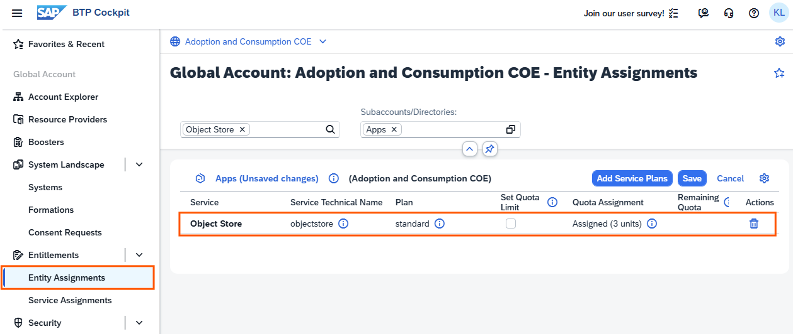
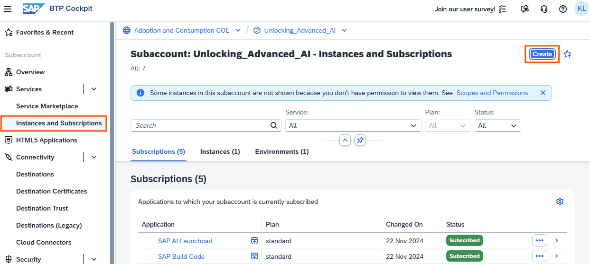
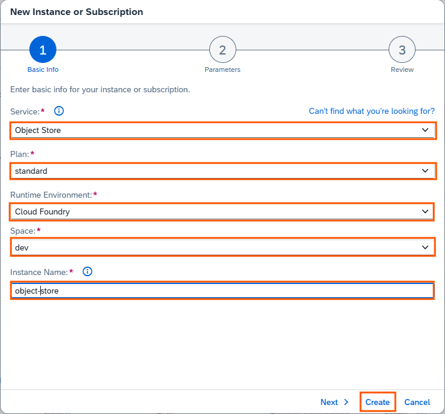
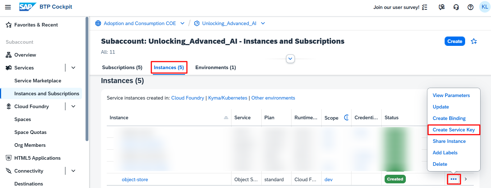
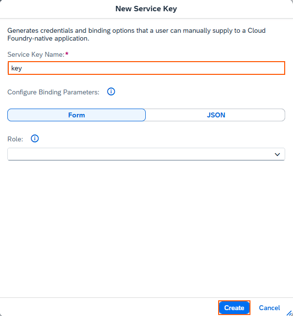
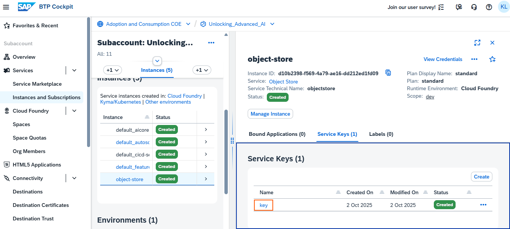
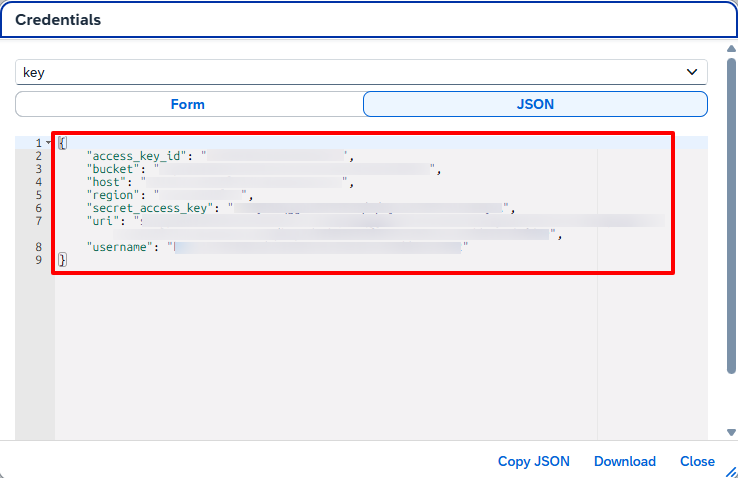
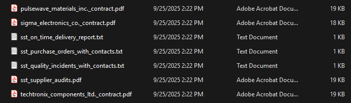
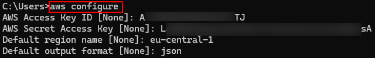
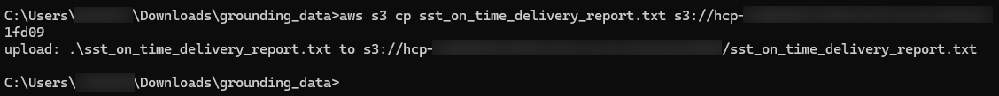

## Set Up Object Store

1. Navigate to your global account and ensure the **Object Store** with '**standard**' plan is assigned to the subaccount. 

    

2. Navigate to your subaccount and choose **Instances and Subscriptions** -> **Create**. 

    

3. Configure the Object Store with the following and choose **Create**. 

    - Service: **Object Store**
    - Plan: **standard**
    - Runtime Environment: **Cloud Foundary**
    - Space: **dev**
    - Instance Name: **object-store** 

    

4. Once the Object Store is created, choose **Create Service Key**. 

    

5. Provide a **Service Key Name** and choose **Create**. 

    

6. Open the service key. 

    

7. Note down the service key details; they will be required in subsequent steps.

    

## Upload Grounding Data to Object Store

1. Download and install [**AWS Command Line Interface**](https://docs.aws.amazon.com/cli/latest/userguide/getting-started-install.html). 

2. Download the [**grounding data**](https://d.dam.sap.com/a/iND4HUy?rc=10&doi=SAP1241295) and extract the files into a local directory. 

    

3. Open the command line interface and configure AWS S3 credentials using the service key details.

    ```
    AWS Configure
    ```
    

4. Use the `s3 cp` command to copy objects from a local directory. 

    ```
    aws s3 cp <source> <target> [--options]
    ```
    > **s3 cp Example**  
    > The following example copies a local file from your current working directory to the Amazon S3 bucket with the s3 cp command.
    > ```
    > aws s3 cp filename.txt s3://amzn-s3-demo-bucket
    > ```

    