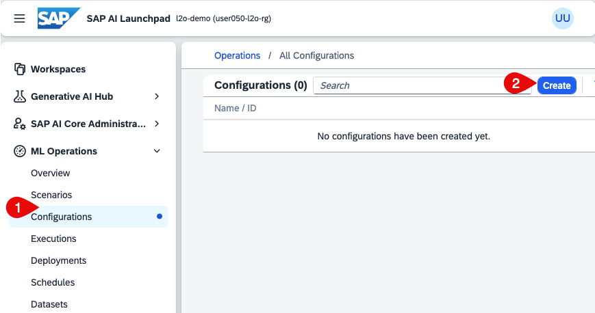
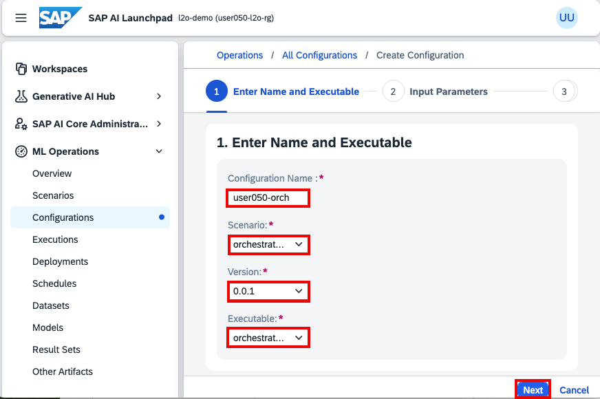
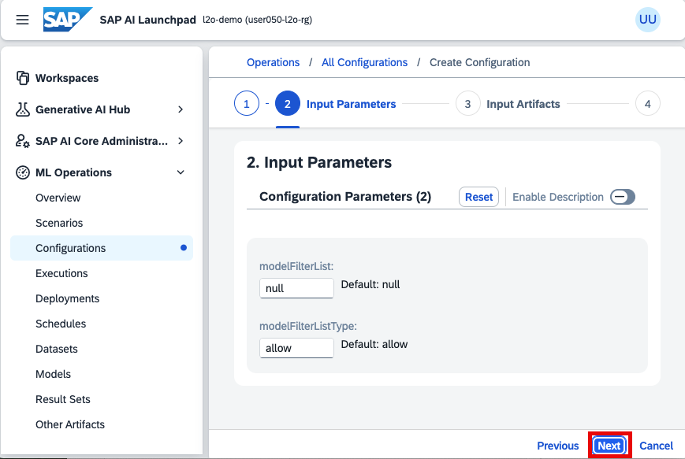
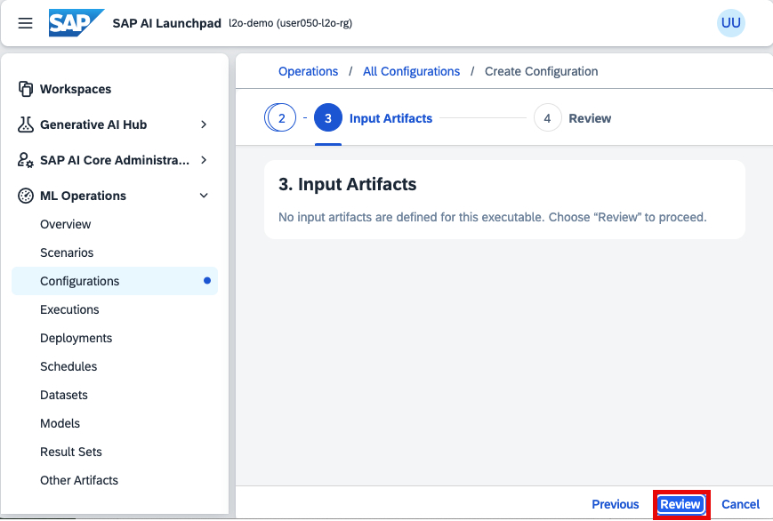
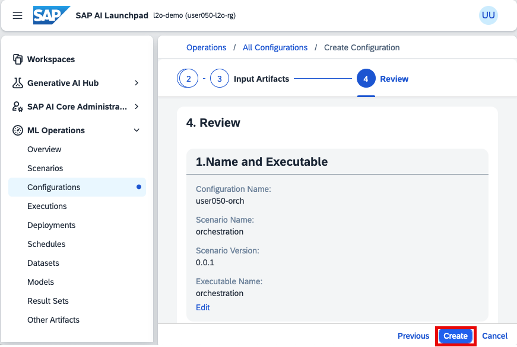
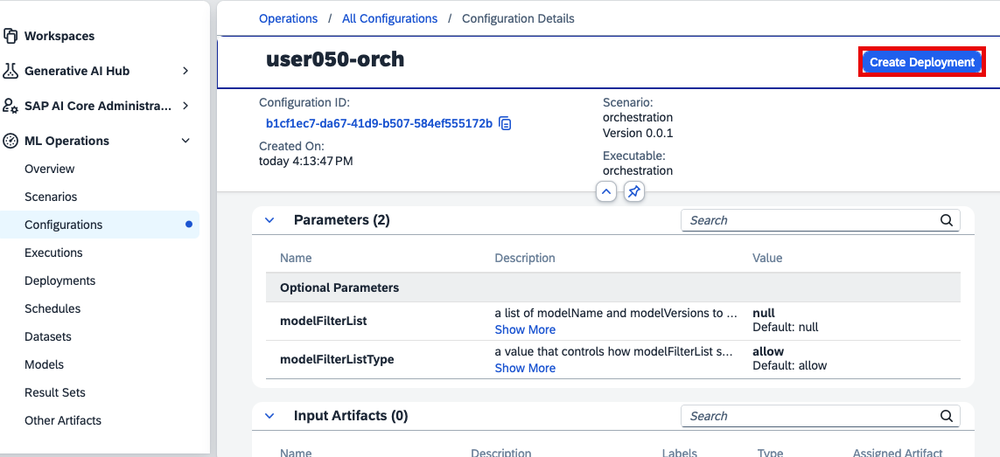
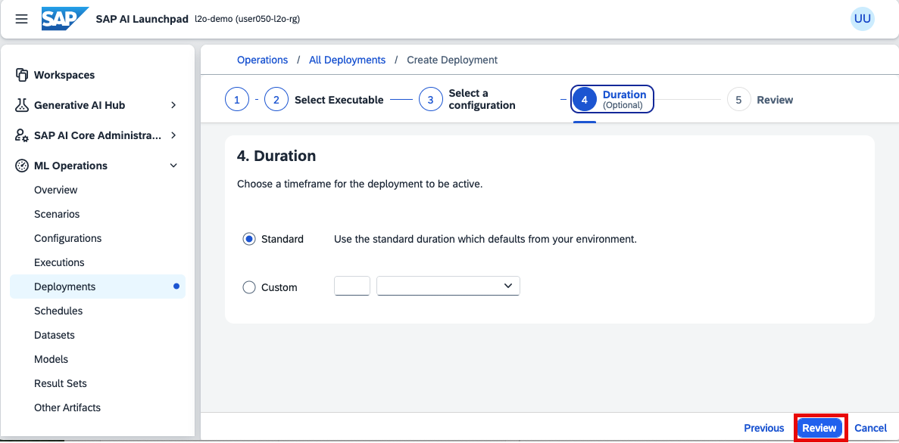
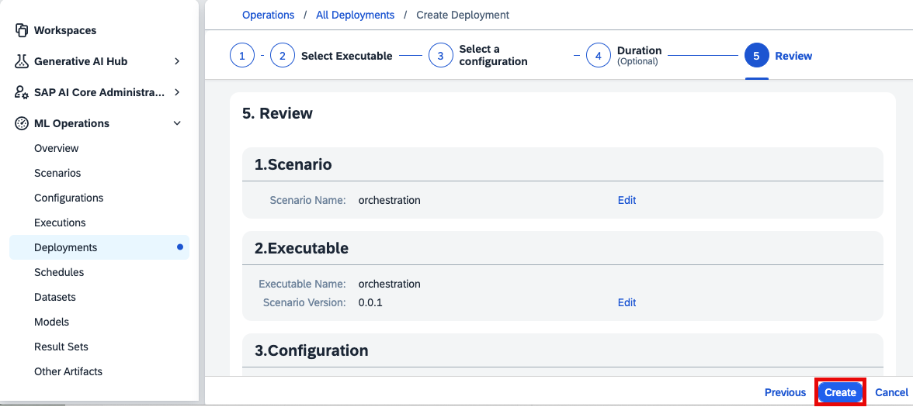
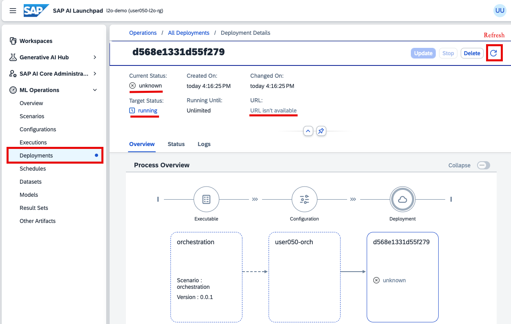
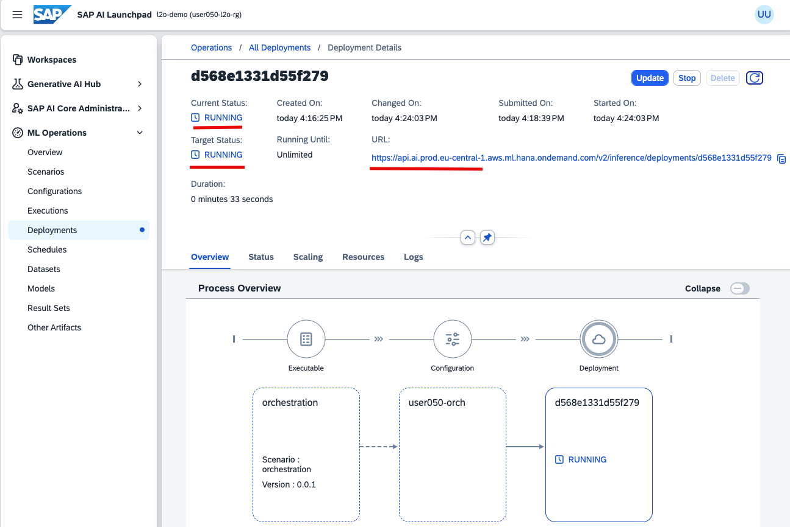

### Deploy Orchestration Service 

1. Choose **ML Operations** -> **Configurations** -> **Create**.

    

2. Configure your orchestration with the following:

    - Configuration Name: **my-first-orchestration**
    - Scenario: **orchestration**
    - Version: **0.0.1**
    - Executable: **orchestration**
    - Choose **Next**.

    

3. Choose **Next**.

    

5. Choose **Review**. 

    

6. Review the properties of your orchestraion and choose **Create**. 

    

7. Choose **Create Deployment**.

    

8. Choose the duration as **Standard** and choose **Review**. 

    

9. Review the details and choose **Create**. 

    

    **Now the deployment has started.** Monitor the status changes here. 
    On the deployment screen, you can see the Target Status is **RUNNING** and in the beginning, the Current Status is **UNKNOWN**.  Also, the deployment URL shows *URL isn't available* until the orchestration is deployed.  

    > 📝**Note**: The deployment could take a few minutes depending on the server's status, network, the number of parallel jobs, etc. You can refresh the status by clicking the refresh icon on the top right of the screen. 
    > 

10. Finally, you will see the orchestration is deployed. 

    
