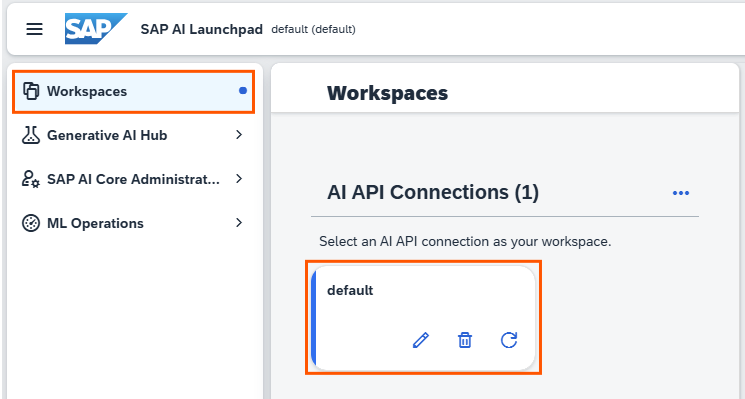
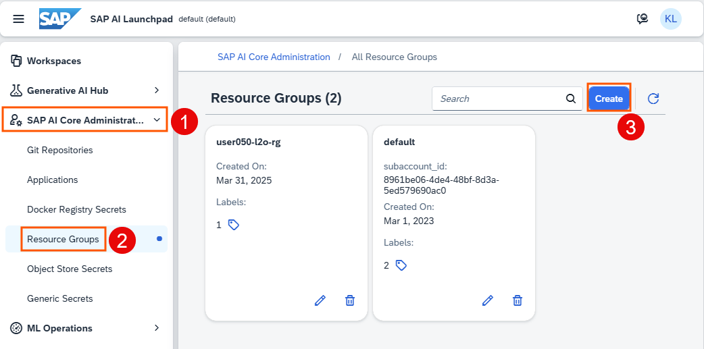
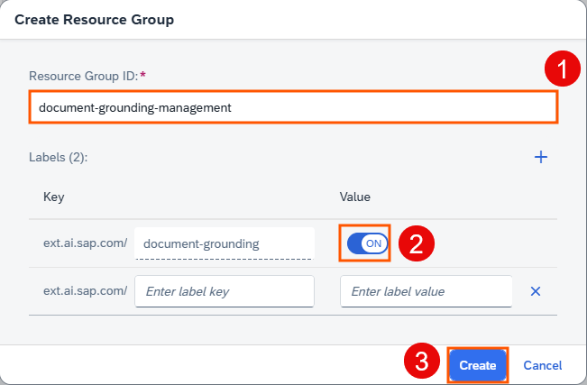
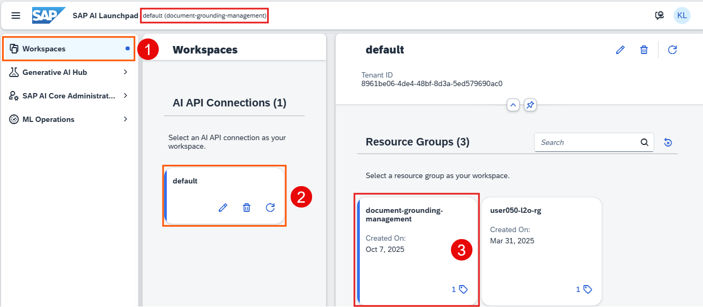
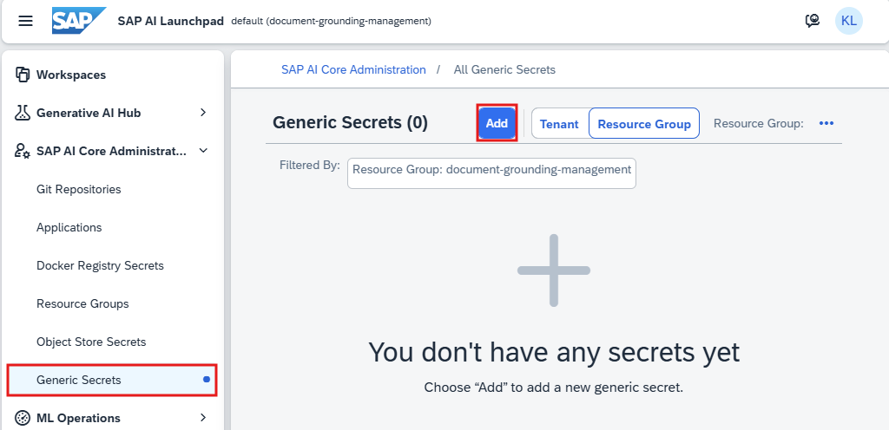
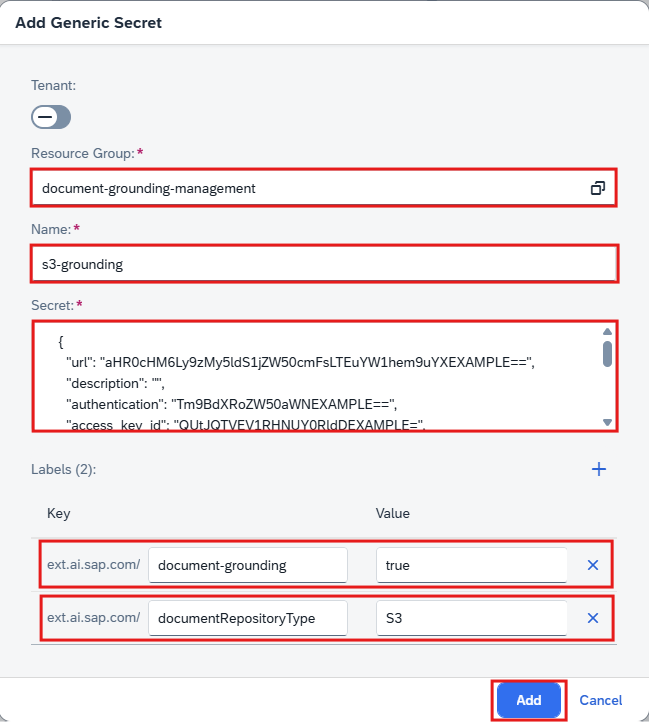
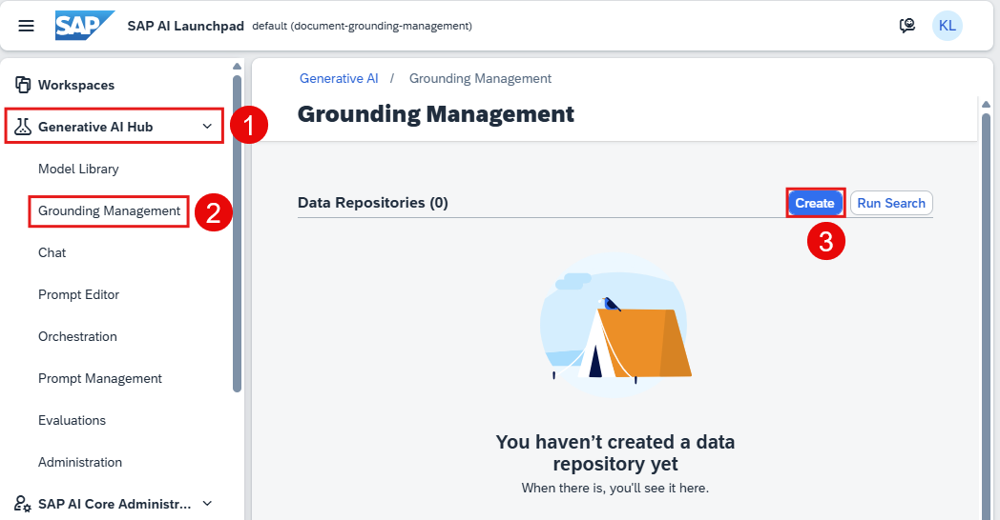
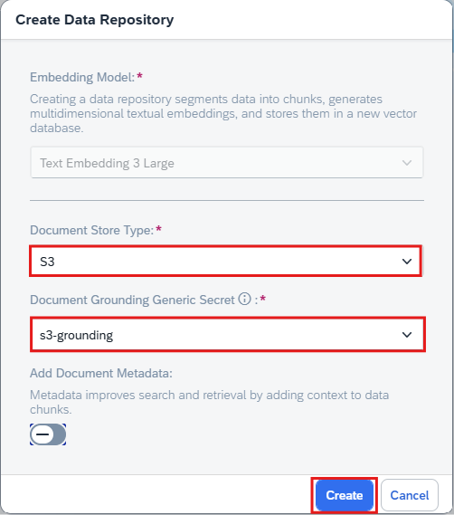
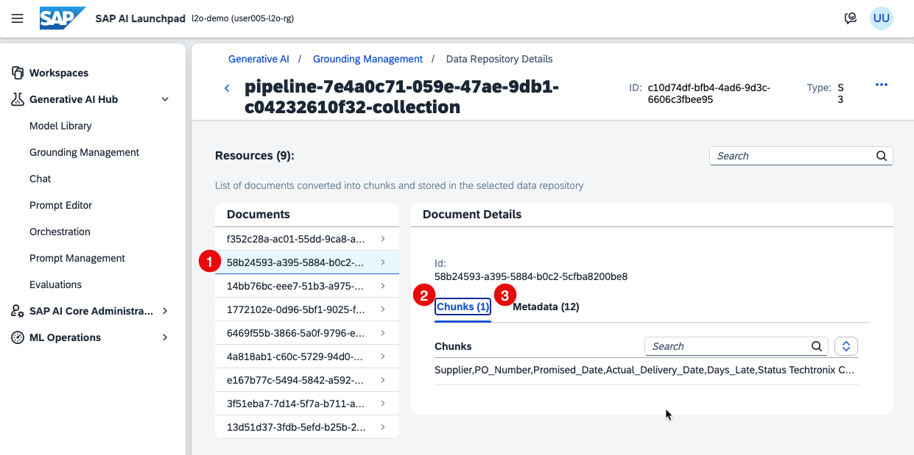

## Create a Resource Group for Grounding

1. Navigate to **SAP AI LaunchPad** amd choose the workspace. 

    

2. Choose **SAP AI Core Administration** -> **Resource Groups** -> **Create**.

    >💡**Tip**: When your tenant is onboarded, a default resource group is automatically created. However, document grounding is not enabled in the default resource group. Therefore, you need to create a new resource group with document grounding capabilities enabled.

    

3. Configure your resource group with the following: 
    - Resource Group ID: **document-grounding-management**
    - document-grounding: **ON**
    - Choose **Create**.

    

4. Choose **Workspaces** -> **default** -> **document-grounding-management**.

    

    >📝**Note**: The new resource group may take a short while to be provisioned and appear in the list. 

## Add Generic Secrets for Grounding

1. Choose **SAP AI Core Adminstration** -> **Generic Secrets** -> **Add**. 

    

2. Configure your grounding secrets with the following: 

    - Resource Group: **document-grounding-management**
    - Name: **s3-grounding**
    - Secret: Refer to the [SAP Help Portal](https://help.sap.com/docs/sap-ai-core/sap-ai-core-service-guide/grounding-generic-secrets-for-aws-s3-15eb50b05c3a4394ba86677209be8f40) for more details about the generic secret for AWS S3. 
    >**Generic Secret Example**  
    >The generic secret values are copied from Object Store service key and must be [Base64-encoded](https://www.base64decode.org/). 
    >```json
    >{
    >  "url": "aHR0cHM6Ly9zMy5ldS1jZW50cmFsLTEuYW1hem9uEXAMPLE==",
    >  "description": "",
    >  "authentication": "Tm9BdXRoZW50aWNhEXAMPLE==",
    >  "access_key_id": "QUtJQTVEV1RHNUY0REXAMPLE=",
    >  "bucket": "aGNwLTM0ZDY3ODc4LWZkZDUtNGYxOS1iZDIwLTI0ZTcwZEXAMPLE==",
    >  "host": "czMtZXUtY2VudHJhbC0xLmFtYXpvbmEXAMPLE=",
    >  "region": "ZXUtY2VudHEXAMPLE",
    >  "username": "aGNwLXMzLWUxZmRkMzg2LWEwNWQtNGQ3Ni1hYjE3LTdlYmY1YzMEXAMPLE==",
    >  "secret_access_key": "QU5WcHg3ZkI0OU1mdGNFb2lBcFVqeW9kYkV3dFc0bkMzaEXAMPLE=="
    >}
    >```

    - Key 1: choose **document-grounding** and **true**
    - Key 2: choose **documentRepositoryType** and **S3**
    - Choose **Add**. 

    

## Create Grounding Management
1. Choose **Generative AI Hub** -> **Grounding Management** -> **Create**.

    

2. Configure your grounding management with the following: 

    - Document Store Type:  **S3**
    - Document Grounding Generic Secret: **s3-grounding**
    - Choose **Create**. 
    
    

    >📝**Note**: The document may take a short while to be converted into chunks and stored in the data repository. 

3. Choose any document to review the document details. Each document is automatically divided into smaller chunks, with the number of chunks depending on the document’s size. The associated metadata for each document is also displayed for your reference.

    